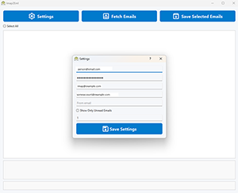
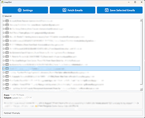

# Imap2Eml

**Imap2Eml** is a desktop tool built with PyQt5 that connects to your IMAP Mail account, lists emails since selected days before until now, with from and to email filters, and lets you selectively export them as `.eml` files — complete with attachments and metadata.




---

## Features
-  Connects to Mail via IMAP  
-  Lists recent emails with checkboxes in a custom HTML-based template  
-  Saves selected emails as `.eml` with attachments intact  
-  Filters emails by target, recipient, and date range  

---

## Installation

### 1. Clone the repo

```bash
git clone https://github.com/afifdev/Imap2Eml.git
cd Imap2Eml
```

### 2. Install requirements

```bash
pip install -r requirements.txt
```

## Building the App

To build a standalone `.exe` using PyInstaller:

```bash
pyinstaller src/main.py --noconfirm --windowed --onefile --icon=resources/icon.ico ^
  --add-data "resources/style.qss;resources" ^
  --add-data "resources/logo.png;resources" ^
  --add-data "resources/icons;resources/icons"
```

---

## Testing

Tests are located in `/tests`. Run them with:

```bash
pytest
```

---

##  License

This project is licensed under the [MIT License](./LICENSE).

---

## Credits

Created by [Afif Say](https://github.com/afifs)  
Icons sourced from open SVG repositories  
Powered by PyQt5, imaplib2, BeautifulSoup, and cryptography